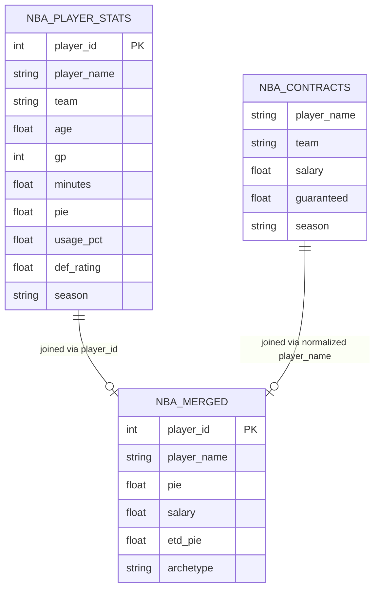

# Entity-Relationship Diagram

This project integrates two source datasets into a single analytical dataset.

## Notes

- The two source datasets have no shared unique identifier. Integration is performed via normalized player name matching (Unicode decomposition, ASCII coercion, suffix removal, lowercasing, punctuation removal).
- `player_id` is unique within `nba_player_stats` and is preserved as the primary key in the merged dataset.
- `player_name` in `nba_contracts` is treated as a candidate key for matching purposes only.
- Of 520 cleaned stats rows, 411 matched to contract rows; 109 stats rows had no contract match (predominantly free agents and two-way contract players).
